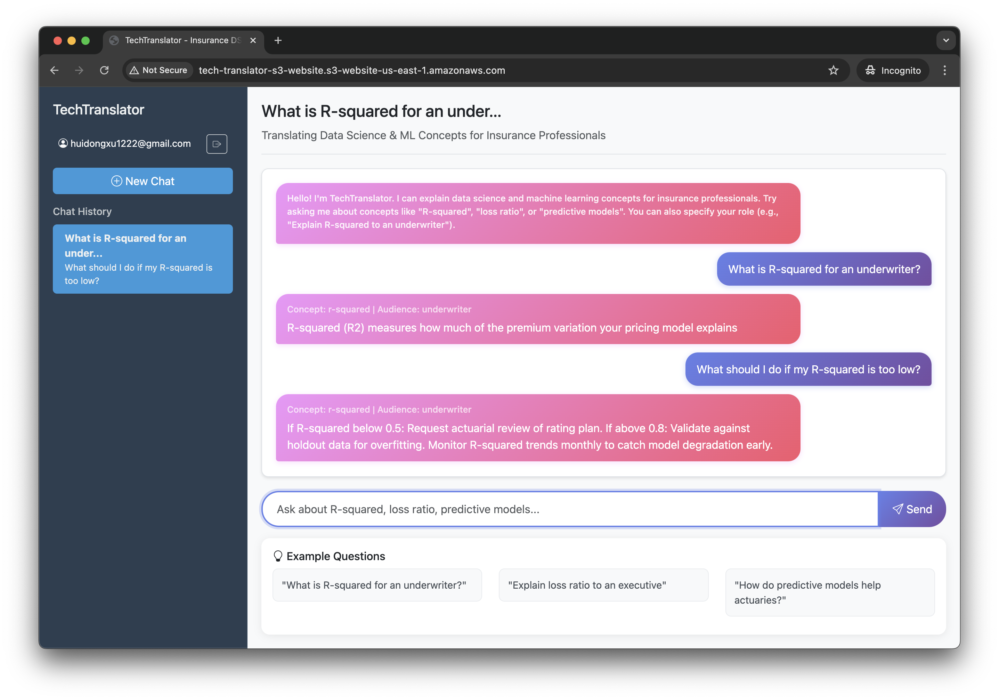
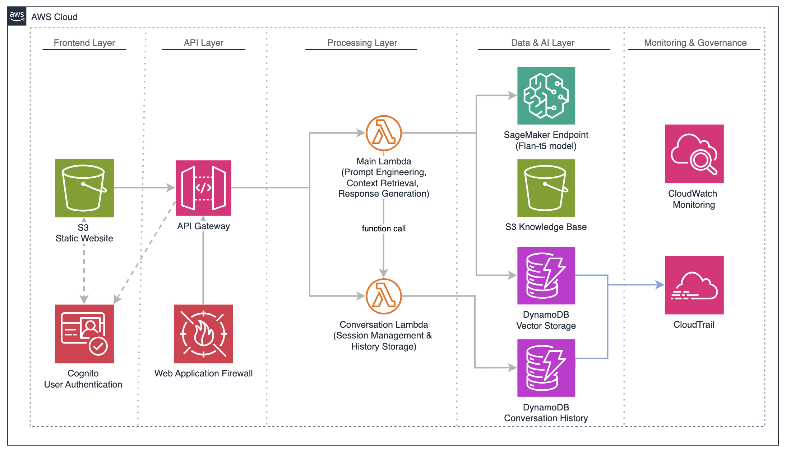
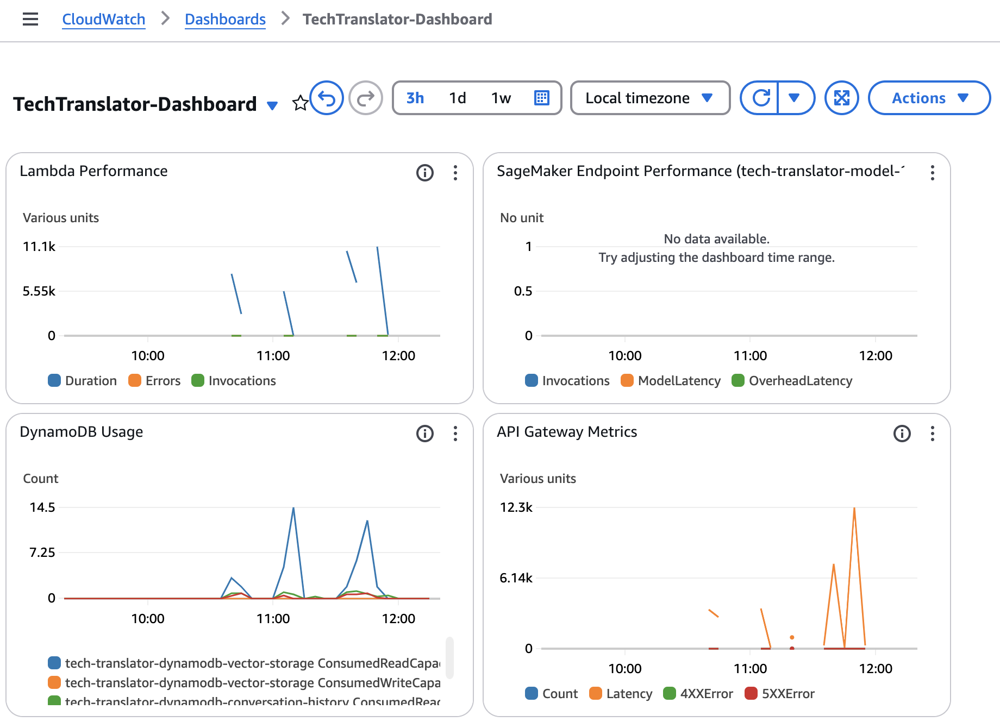
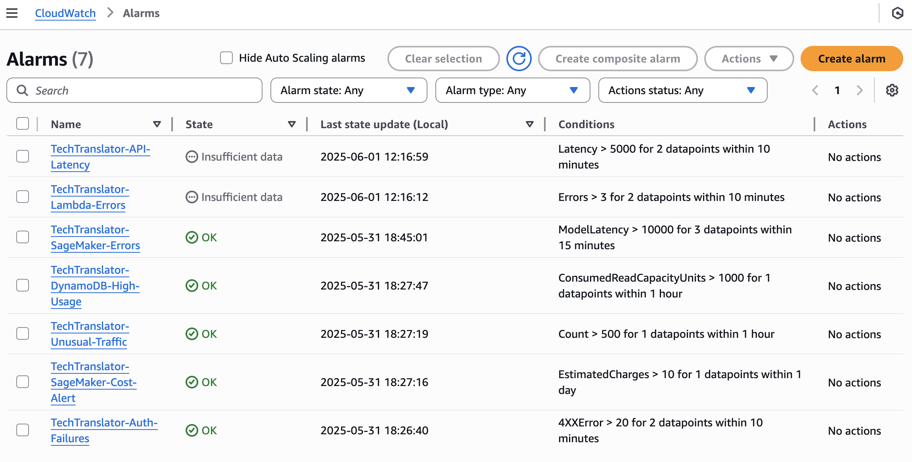

# TechTranslator 🤖

**AI-Powered Data Science & Machine Learning Concept Translator for Insurance Professionals**

A cloud-native application that bridges the communication gap between data scientists and insurance stakeholders by providing role-specific explanations of complex DS/ML concepts using AWS serverless architecture and FLAN-T5 language model.

## 🎯 Project Overview

TechTranslator translates complex data science concepts like R-squared, loss ratio, and predictive models into clear, contextual explanations tailored for different insurance professionals (underwriters, actuaries, executives). The system uses Retrieval Augmented Generation (RAG) and advanced prompt engineering to deliver professional-grade explanations.


### Key Features

- 🧠 **AI-Powered Explanations**: Uses FLAN-T5-Large model for intelligent text generation
- 👥 **Role-Specific Content**: Tailored explanations for underwriters, actuaries, and executives
- 💬 **Conversational Interface**: Multi-turn conversations with context preservation
- 🔐 **Secure Authentication**: AWS Cognito-based user management
- 📊 **Comprehensive Monitoring**: CloudWatch dashboards and governance alarms
- 🛡️ **Security First**: WAF protection, encryption, and audit logging

## 🏗️ Architecture

The application follows a four-layer serverless architecture:


### Frontend Layer
- **S3 Static Website**: React-based web application
- **CloudFront**: Global content delivery
- **Cognito**: User authentication and session management

### API Layer
- **API Gateway**: RESTful API with authentication
- **WAF**: Security protection and rate limiting

### Processing Layer
- **Main Lambda**: Query processing, prompt engineering, RAG implementation
- **Conversation Lambda**: Session management and history tracking

### Data & AI Layer
- **SageMaker**: FLAN-T5-Large model deployment
- **DynamoDB**: Vector embeddings and conversation storage
- **S3**: Knowledge base repository
- **CloudWatch/CloudTrail**: Monitoring and audit logging

## 🚀 Quick Start

### Prerequisites

- AWS Academy Learner Lab account or AWS account
- AWS CLI configured
- Bash shell environment

### Deployment Steps

1. **Clone the repository**
   ```bash
   git clone <repository-url>
   cd techtranslator
   ```

2. **Deploy the infrastructure**
   ```bash
   chmod +x deploy.sh
   ./deploy.sh
   ```

3. **Deploy the AI model** (using SageMaker Studio)
   - Open the `sagemaker-notebook/pure-deployment.ipynb` notebook
   - Run all cells to deploy FLAN-T5-Large model
   - Note the endpoint name for step 4

4. **Update Lambda with model endpoint**
   ```bash
   aws cloudformation update-stack \
     --stack-name tech-translator-lambda \
     --use-previous-template \
     --parameters ParameterKey=SageMakerEndpointName,ParameterValue=YOUR_ENDPOINT_NAME \
     --capabilities CAPABILITY_IAM CAPABILITY_NAMED_IAM
   ```

5. **Setup knowledge base** (using SageMaker Studio)
   - Run `sagemaker-notebook/rag-implementation.ipynb` to populate the vector database

## 📁 Project Structure

```
.
├── deploy.sh                          # Main deployment script
├── frontend/                          # React web application
│   ├── public/
│   │   ├── favicon.ico
│   │   └── index.html
│   └── src/
│       ├── css/styles.css             # Application styling
│       └── js/
│           ├── api.js                 # API service layer
│           ├── app.js                 # Main application logic
│           └── auth.js                # Authentication service
├── infrastructure/                    # CloudFormation templates
│   ├── api-gateway.yaml              # API Gateway with authentication
│   ├── cloudtrail.yaml               # Audit logging
│   ├── cloudwatch.yaml               # Monitoring and alarms
│   ├── cognito.yaml                  # User authentication
│   ├── dynamodb.yaml                 # Vector and conversation storage
│   ├── lambda.yaml                   # Serverless functions
│   ├── s3.yaml                       # Static hosting and storage
│   └── waf.yaml                      # Security protection
├── lambda/                           # Serverless functions
│   ├── conversation/
│   │   ├── lambda_function.py        # Conversation management
│   │   └── requirements.txt
│   └── main/
│       ├── lambda_function.py        # Main query processing
│       └── requirements.txt
├── sagemaker-notebook/               # AI model deployment
│   ├── pure-deployment.ipynb         # Model deployment
│   ├── rag-implementation.ipynb      # Knowledge base setup
│   └── flan-t5-deployment-testing.ipynb
├── package-lambda.sh                 # Lambda packaging script
└── upload-frontend.sh                # Frontend deployment script
```

## 🔧 Configuration

### Environment Variables

The application uses CloudFormation parameters for configuration:

- `SageMakerEndpointName`: Your deployed FLAN-T5 endpoint
- `EnableAuthForQuery`: Enable/disable authentication (default: true)
- `DailyCostThreshold`: Cost monitoring threshold (default: $10/day)

### Security Configuration

- **Authentication**: AWS Cognito with email verification
- **API Protection**: WAF with rate limiting (2000 requests/5min)
- **Data Encryption**: Server-side encryption for S3 and DynamoDB
- **Audit Logging**: CloudTrail monitoring of data access

## 📊 Monitoring & Governance

### CloudWatch Dashboard
- Lambda performance metrics (duration, errors, invocations)
- API Gateway metrics (requests, latency, error rates)
- DynamoDB usage (read/write capacity)
- SageMaker endpoint performance (when configured)


### Governance Alarms
- **Cost Governance**: SageMaker spending alerts
- **Security Governance**: Authentication failure monitoring
- **Operational Governance**: Unusual traffic detection
- **Data Governance**: DynamoDB usage monitoring


## 🧪 Testing

The project includes comprehensive testing through Jupyter notebooks:

### Knowledge Base Testing
```bash
# Run in SageMaker Studio
sagemaker-notebook/rag-implementation.ipynb
```

### Model Integration Testing
```bash
# Run in SageMaker Studio
sagemaker-notebook/flan-t5-deployment-testing.ipynb
```

## 💰 Cost Optimization

### Current Costs (Development)
- **SageMaker**: ~$40/month (8 hours/day, 5 days/week)
- **Lambda**: $0 (within free tier)
- **DynamoDB**: ~$1/month (pay-per-request)
- **Other services**: ~$2/month
- **Total**: ~$43/month

### Cost Optimization Strategies
- Scheduled endpoint management (70% SageMaker savings)
- Serverless inference for low-volume usage
- Response caching for common queries
- TTL-based data cleanup (30-day retention)

## 🔐 Security Measures

### Multi-Layer Security
1. **User Authentication**: Cognito with JWT tokens
2. **API Security**: CORS, HTTPS, rate limiting via WAF
3. **Data Protection**: Encryption at rest and in transit
4. **Application Security**: Input validation, error handling
5. **Monitoring**: CloudWatch alarms, CloudTrail audit logs

## 🎯 Use Cases

### Example Queries
- "What is R-squared for an underwriter?"
- "Explain loss ratio to an executive"
- "How do predictive models help actuaries?"
- "If R-squared is 0, what does it mean?" (follow-up)

### Supported Concepts
- **R-squared**: Model performance measurement
- **Loss Ratio**: Profitability metric in insurance
- **Predictive Models**: AI/ML applications in insurance

## 🔄 Future Enhancements

### Advanced AI Capabilities
- Fine-tuning for insurance domain
- Multi-modal document analysis
- Ensemble models for different insurance lines

### Platform Enhancements
- Edge computing integration
- Global multi-region deployment
- Advanced model drift detection

### User Experience
- Voice interface integration
- Native mobile applications
- Interactive visualizations

## 📝 Documentation


### Key Technologies
- **Frontend**: React, HTML5, CSS3, JavaScript
- **Backend**: AWS Lambda (Python), API Gateway
- **AI/ML**: SageMaker, FLAN-T5-Large, RAG
- **Storage**: DynamoDB, S3
- **Security**: Cognito, WAF, CloudTrail
- **Monitoring**: CloudWatch, CloudFormation


